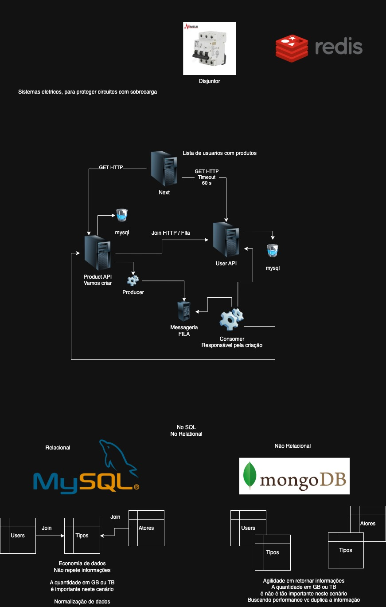

# UserServiceAPI

Projeto base para curso de Microserviços com Java Spring Boot e MySQL.

## 📚 Descrição
API de usuários construída com Spring Boot, conectada a um banco MySQL, pronta para ser usada como microserviço em uma arquitetura maior. Inclui seed de dados, endpoints REST e estrutura recomendada para projetos reais.

## 🚀 Tecnologias
- Java 17+
- Spring Boot
- Spring Data JPA
- MySQL (via Docker)
- Maven

## ⚙️ Requisitos
- Java 17 ou superior
- Maven
- Docker (para rodar o MySQL)

## 🐬 Subindo o MySQL com Docker
Execute no terminal:
